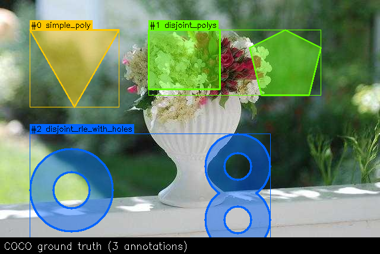
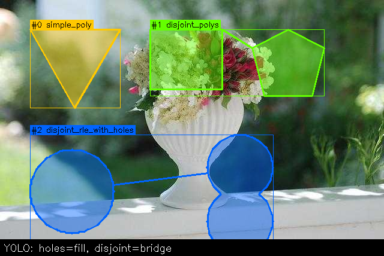
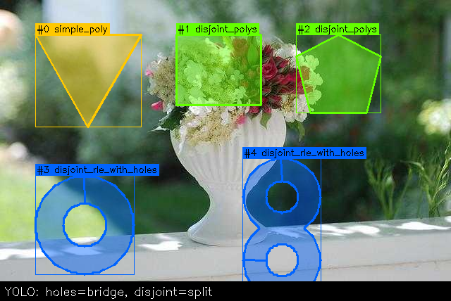
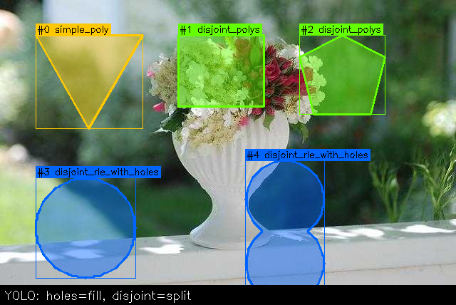

# cocoyolo

Bidirectional **COCO (json) ↔ YOLO Ultralytics (txt)** format converter for **object detection** and **instance segmentation** datasets.

Works out of the box for the simple cases, and handles the hard ones too: **RLE masks**, **holes**, **disjoint regions**, and **mixed annotation types** — all the edge cases that other tools silently break on.

## Why Another Converter?

COCO-to-YOLO conversion is one of those tasks that seems trivial until you try it on a real-world dataset.  If all your annotations are simple polygon outlines, or maybe just bounding boxes, any converter will likely do.  The trouble starts when your dataset contains:

- **RLE-encoded masks** (common when exporting mask/brush tool shapes from CVAT, SA, or the original COCO dataset itself)
- **Holes** in masks (e.g., a donut, or an object with a window through it)
- **Disjoint regions** in a single annotation (e.g., an occluded object visible in two separate areas)
- **A mix of bounding boxes and segmentation masks** in the same JSON file

Every major ML framework or Data management library ships some version of this conversion.  None of them handled all of the above correctly when I needed them to:

| Tool | RLE masks | Disjoint regions | Holes | Mixed bbox/seg |
|------|-----------|-------------------|-------|----------------|
| **Ultralytics** `convert_coco` | Silently skipped ([#4931](https://github.com/ultralytics/ultralytics/issues/4931)) | Merged via lossy bridge | Filled in — no support ([#19153](https://github.com/ultralytics/ultralytics/issues/19153)) | Can produce mixed output |
| **FiftyOne** | Imported as masks, dropped on YOLO export until late 2025 ([#6421](https://github.com/voxel51/fiftyone/issues/6421)) | Was incorrectly chained; now split into separate instances | No positive/negative space concept | Was bbox-only for masks |
| **Datumaro** (upstream) | No segmentation export at all ([#1114](https://github.com/open-edge-platform/datumaro/issues/1114)) | N/A | N/A | Bbox-only |
| **Datumaro** (CVAT fork) | Silently skipped | Exported as separate instances | Not handled | — |
| **Roboflow** Supervision | Added mid-2024; previously crashed | Crashes the loader ([#1209](https://github.com/roboflow/supervision/issues/1209)) | Not documented | — |
| **cocoyolo** | Fully decoded and contoured | Configurable: bridge or split | Configurable: bridge or fill | Auto-detected; enforced uniform output |

So I decided to design a new, powerful and flexible converter, `cocoyolo`, specifically to fill these gaps.

### What cocoyolo does differently

- **Full RLE support.**  RLE masks (compressed or uncompressed) are decoded to binary masks, contoured with `cv2.findContours`, and converted to polygons.  Nothing is silently skipped.

- **Hole-aware conversion.**  Using `cv2.RETR_CCOMP` hierarchy, outer contours and their child holes are identified.  You choose what to do with them: `--hole-strategy bridge` preserves holes via zero-width inverse bridges (lossless when rasterised), or `--hole-strategy fill` discards them.

- **Disjoint region handling.**  Multiple connected components in a single annotation are detected and handled via `--disjoint-strategy bridge` (connect them with a greedy nearest-neighbour chain of zero-width bridges into one polygon) or `--disjoint-strategy split` (emit each region as a separate YOLO annotation).

- **Uniform output guarantee.**  YOLO expects either all bounding boxes or all polygons — never both in the same dataset.  `cocoyolo` pre-scans the annotations, auto-detects the task type, and raises a clear error on mixed datasets with explicit instructions (`--task detect` to force bounding boxes, `--task segment` to keep only segmentation).

- **Conversion statistics.**  Every run prints exactly what happened: how many annotations of each type were processed, how many edge cases were encountered, and how each was resolved.

## Installation

```bash
pip install .
```

Or in development mode:

```bash
pip install -e .
```

For faster image size reading (header-only via pyvips):

```bash
pip install -e ".[fast]"
```

## Quick Start

### Command line

```bash
# COCO → YOLO (default: bridge holes + bridge disjoint regions)
coco2yolo path/to/coco path/to/yolo

# COCO → YOLO with explicit strategies
coco2yolo path/to/coco path/to/yolo --hole-strategy fill --disjoint-strategy split

# Force bounding-box output (for mixed datasets)
coco2yolo path/to/coco path/to/yolo --task detect

# YOLO → COCO
yolo2coco path/to/yolo path/to/coco

# Unified CLI with subcommands
cocoyolo coco2yolo path/to/coco path/to/yolo
cocoyolo yolo2coco path/to/yolo path/to/coco
```

### Python API

```python
from cocoyolo import coco_to_yolo, yolo_to_coco

# COCO → YOLO (default strategies: bridge both)
info, stats = coco_to_yolo("path/to/coco", "path/to/yolo")

# COCO → YOLO with explicit strategies
info, stats = coco_to_yolo(
    "path/to/coco",
    "path/to/yolo",
    hole_strategy="bridge",      # or "fill"
    disjoint_strategy="bridge",  # or "split"
    task="auto",                 # or "detect", "segment"
)

# YOLO → COCO
info, stats = yolo_to_coco("path/to/yolo", "path/to/coco")
```

### Example output

```
Conversion complete (COCO → YOLO).
  Classes:  80
  Images:   5000
  Splits:   ['val']
  Output:   path/to/yolo

  YOLO task type:        segment
  Annotations processed: 36781
    Polygon (single):    32813
    Polygon (disjoint):  3522
    RLE (simple):        25
    RLE (with holes):    236
    RLE (disjoint):      185
  Edge cases: 3943
    Holes (bridge):    396 contour(s) bridged
    Disjoint (bridge): 3931 annotation(s) bridged
```

## Supported Dataset Layouts

All layouts are **auto-detected** — just point the tool at the root directory.

### COCO layouts

**COCO-A** — the standard COCO layout.  Annotation JSONs live in `annotations/`, images are split into subdirectories under `images/`.  This is what you get from the [official COCO dataset](https://cocodataset.org/) or most tools that follow the COCO standard.

```
dataset/
├── annotations/
│   ├── instances_train.json
│   └── instances_val.json
└── images/
    ├── train/
    │   ├── 000001.jpg
    │   ├── 000002.jpg
    │   └── ...
    └── val/
        ├── 000101.jpg
        └── ...
```

**COCO-B** — the Roboflow layout.  Each split is a self-contained folder with its own `_annotations.coco.json` and images placed alongside it.  This is what you get when exporting a dataset from [Roboflow](https://roboflow.com/) in COCO format, or what their [RF-DETR model expects](https://rfdetr.roboflow.com/learn/train/#dataset-structure).

```
dataset/
├── train/
│   ├── _annotations.coco.json
│   ├── img_001.jpg
│   ├── img_002.jpg
│   └── ...
└── val/
    ├── _annotations.coco.json
    ├── img_101.jpg
    └── ...
```

**COCO-C** — flat layout with no split subdirectories.  A single `annotations/` folder and a single `images/` folder.  Common for small or single-split datasets (like those that are exported from CVAT).

```
dataset/
├── annotations/
│   └── instances.json
└── images/
    ├── photo_a.png
    ├── photo_b.png
    └── ...
```

### YOLO layouts

**YOLO-A** — the standard Ultralytics layout.  Images and labels live under top-level `images/` and `labels/` directories, each split into subdirectories by split name.  A `data.yaml` at the root defines class names.

```
dataset/
├── data.yaml
├── images/
│   ├── train/
│   │   ├── 000001.jpg
│   │   ├── 000002.jpg
│   │   └── ...
│   └── val/
│       ├── 000101.jpg
│       └── ...
└── labels/
    ├── train/
    │   ├── 000001.txt
    │   ├── 000002.txt
    │   └── ...
    └── val/
        ├── 000101.txt
        └── ...
```

**YOLO-B** — split-first layout.  Each split is a self-contained folder with its own `images/` and `labels/` subdirectories.  Also used by some Roboflow YOLO exports.

```
dataset/
├── data.yaml
├── train/
│   ├── images/
│   │   ├── 000001.jpg
│   │   └── ...
│   └── labels/
│       ├── 000001.txt
│       └── ...
└── val/
    ├── images/
    │   ├── 000101.jpg
    │   └── ...
    └── labels/
        ├── 000101.txt
        └── ...
```

## Task Type Detection

YOLO requires uniform label types within a dataset directory: every `.txt` file must contain either all bounding boxes (`class xc yc w h`) or all polygons (`class x1 y1 x2 y2 ...`), never a mix of the two.  COCO, on the other hand, can store both annotation types in the same JSON file. Because of this, maybe in some unintended scenario some objects may end up having only a bounding box, while others carry full segmentation masks.

`cocoyolo` pre-scans the COCO annotations before writing anything, and uses the `--task` flag to decide what to do:

- **`--task auto`** (default) — Counts how many annotations have segmentation data and how many are bbox-only.  If all annotations have segmentation, the output is YOLO segmentation format.  If none do, the output is YOLO detection format.  If the dataset is **mixed** (some with segmentation, some without), conversion stops with a clear error message telling you exactly how many of each type were found, and suggesting the two flags below.

- **`--task detect`** — Forces bounding-box output for every annotation, regardless of whether it has segmentation data or not.  Every COCO annotation already carries a `bbox` field, so nothing is lost and nothing is skipped — you just get detection labels.

- **`--task segment`** — Forces polygon output.  Annotations that have segmentation data are converted normally; annotations that lack it are **skipped** (the conversion stats will report how many were dropped, so you know exactly what happened).

## COCO → YOLO: Strategies for Segmentation of Edge Cases

The images below show an example image with with three annotations (that we can imagine come from a COCO json file) that cover all the tricky cases: apart from a simple polygon, we have two disjoint polygons, and two disjoint RLE-encoded shapes with holes, one of which even has two holes.  Each strategy combination produces a visually different YOLO result, depending on the user choice.

### COCO ground truth

<p align="center"></p>

The source COCO dataset contains three annotations:
- **#0 `simple_poly`** (yellow) — a plain polygon.  No edge cases.
- **#1 `disjoint_polys`** (green) — a single COCO annotation with two disjoint sub-polygons.
- **#2 `disjoint_rle_with_holes`** (blue) — an RLE-encoded mask with two disjoint connected components, each containing one or more holes.

### `holes=bridge, disjoint=bridge` (default)

<p align="center"></p>

Lossless representation.  Every COCO annotation maps to exactly one YOLO line.  Holes are carved out via zero-width inverse bridges (visible as thin lines in the polygon outline, but invisible when rasterised/filled).  Disjoint regions are connected by zero-width bridges between their closest vertices. This strategy tries to mimic in an exact manner the input annotation, despite the YOLO Ultralytics inherent limitation in having no support for multi-polygon annotations or holes. **3 annotations in, 3 annotations out.**

### `holes=fill, disjoint=bridge`

<p align="center"></p>

Holes are filled in — the blue shapes become solid circles.  Disjoint regions are still bridged into a single polygon.  Useful when holes don't matter for your task.  **3 annotations in, 3 annotations out.**

### `holes=bridge, disjoint=split`

<p align="center"></p>

Holes are preserved, but each disjoint region becomes a separate YOLO annotation i.e., a separate instance (note the different integer IDs).  The green pair splits into #1 and #2, the blue pair splits into #3 and #4.  Instance count increases.  **3 annotations in, 5 annotations out.**

### `holes=fill, disjoint=split`

<p align="center"></p>

Maximum simplification. This is what the majority of other tools do, sometimes without even warning the user. Holes are filled and disjoint regions are split.  Each output annotation is a simple, solid polygon.  **3 annotations in, 5 annotations out.**

### How the algorithms work

**Hole bridging** uses `cv2.RETR_CCOMP` hierarchy to identify outer contours and their child holes.  In `bridge` mode, the converter walks the outer boundary and at each hole's closest point, splices in a detour: bridge into the hole, trace the hole boundary in reverse, bridge back, continue the outer boundary.  Each bridge is traversed twice in opposite directions, producing a zero-width seam.  Multiple holes are sorted by position along the outer boundary and spliced in order.

**Disjoint bridging** builds a greedy nearest-neighbour chain through all polygons.  For each adjacent pair in the chain, the closest vertex pair is computed.  Each polygon is entered at its bridge point from the previous polygon and exited at its bridge point toward the next.  The first and last polygons do a full ring; middle polygons do a partial ring between their entry and exit bridge points.  The implicit polygon close creates the final back-bridge.

### Strategy summary

| holes | disjoint | Effect |
|-------|----------|--------|
| `bridge` | `bridge` | Holes preserved, disjoint regions merged into one polygon.  Lossless.  **(default)** |
| `fill` | `bridge` | Holes filled, disjoint regions merged.  Simplest single-polygon output. |
| `bridge` | `split` | Holes preserved, each region becomes a separate instance. |
| `fill` | `split` | Holes filled, regions split.  Maximum simplification. |

## YOLO → COCO

The reverse direction is straightforward.  Each YOLO label line is already a self-contained annotation:

- **Detection** (`class xc yc w h`): Denormalised to absolute pixel bbox in COCO format.
- **Segmentation** (`class x1 y1 x2 y2 ...`): Denormalised to absolute pixel polygon, stored as a single polygon in COCO's `segmentation` field.  Bounding box is recomputed from the polygon vertices.

Category IDs are shifted from YOLO's 0-based indexing to COCO's 1-based convention by default (use `--keep-zero-indexing` to preserve 0-based IDs).

## CLI Reference

### `coco2yolo`

```
usage: coco2yolo [-h] [--task {auto,detect,segment}] [--contour-approx FLOAT]
                 [--hole-strategy {fill,bridge}] [--disjoint-strategy {split,bridge}]
                 [--image-mode {copy,symlink,hardlink}] [--quiet] input output

positional arguments:
  input                 Input COCO dataset directory.
  output                Output YOLO dataset directory.

options:
  --task                YOLO output type: auto, detect, or segment (default: auto).
  --contour-approx      Contour approximation factor (default: 0.001).
  --hole-strategy       How to handle holes in RLE masks (default: bridge).
  --disjoint-strategy   How to handle disjoint regions (default: bridge).
  --image-mode          How to transfer images: copy, symlink, or hardlink (default: copy).
  -q, --quiet           Suppress progress output.
```

### `yolo2coco`

```
usage: yolo2coco [-h] [--keep-zero-indexing] [--image-mode {copy,symlink,hardlink}]
                 [--quiet] input output

positional arguments:
  input                 Input YOLO dataset directory.
  output                Output COCO dataset directory.

options:
  --keep-zero-indexing  Keep 0-based category IDs (default: shift to 1-based).
  --image-mode          How to transfer images: copy, symlink, or hardlink (default: copy).
  -q, --quiet           Suppress progress output.
```

### `cocoyolo` (unified)

```
usage: cocoyolo {coco2yolo,yolo2coco} ...

subcommands:
  coco2yolo   Convert COCO → YOLO.
  yolo2coco   Convert YOLO → COCO.
```

## How Images Are Handled

By default, images are **copied** from the source to the output directory.  This is the safest option and works on every OS and filesystem.

If you want to save disk space, you can use `--image-mode symlink` or `--image-mode hardlink` to create links instead of copies:

```bash
# Save disk space with symbolic links
coco2yolo path/to/coco path/to/yolo --image-mode symlink

# Save disk space with hard links (must be on the same filesystem)
yolo2coco path/to/yolo path/to/coco --image-mode hardlink
```

Or via the Python API:

```python
from cocoyolo import coco_to_yolo

info, stats = coco_to_yolo("path/to/coco", "path/to/yolo", image_mode="symlink")
```

| Mode | Disk usage | OS support | Notes |
|------|-----------|------------|-------|
| `copy` (default) | Full copy | All | Safest; output is fully self-contained. |
| `symlink` | No extra space | Linux, macOS, Windows (dev mode) | Output breaks if source moves. |
| `hardlink` | No extra space | Linux, macOS, Windows | Source and output must be on the same filesystem. |

If symlinks or hard links are not supported on the current platform, the converter logs a warning and falls back to copy automatically.

## License

MIT
